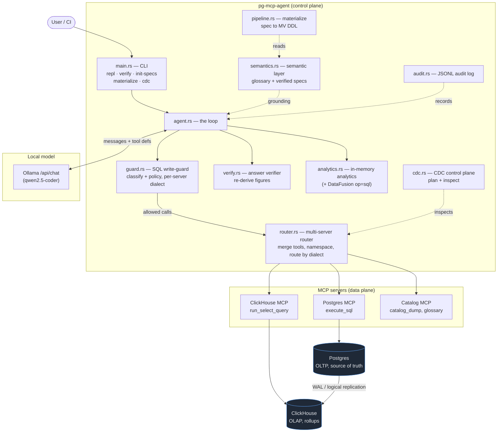
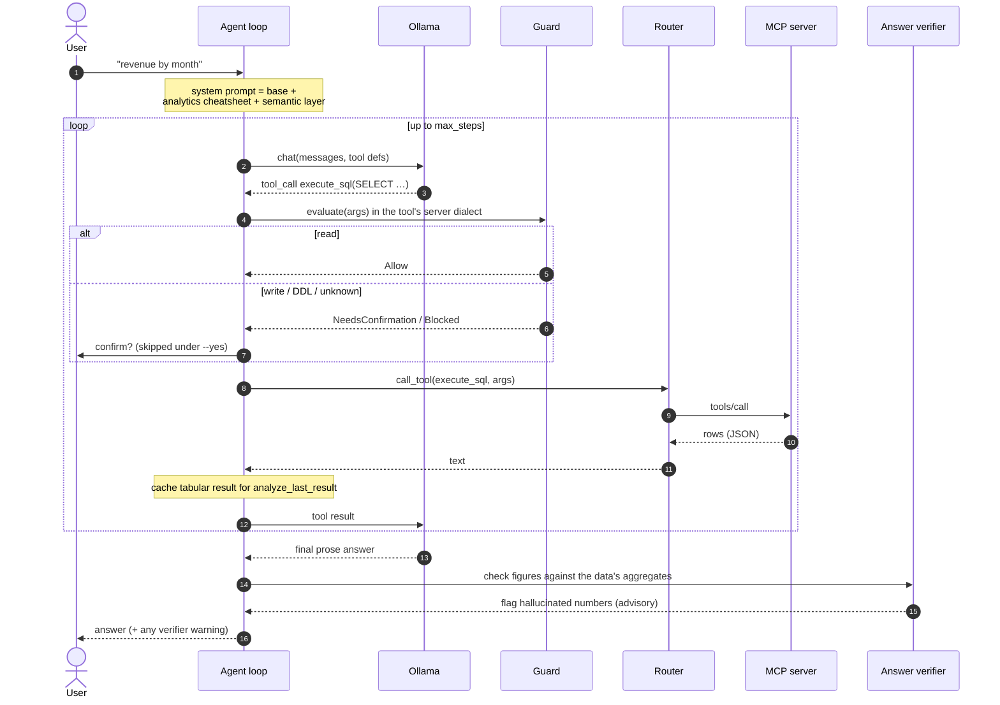
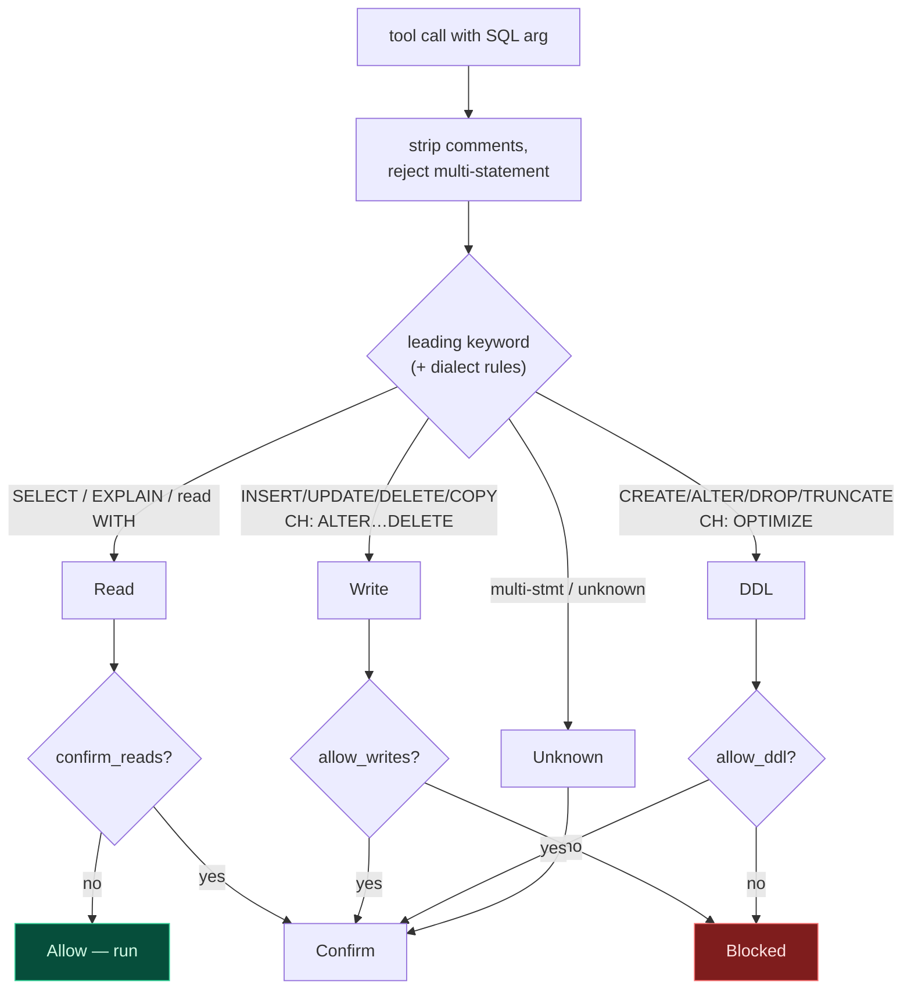
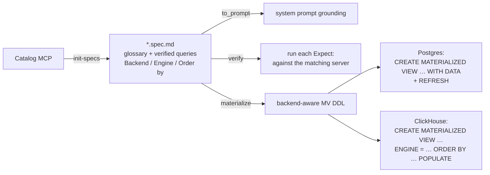
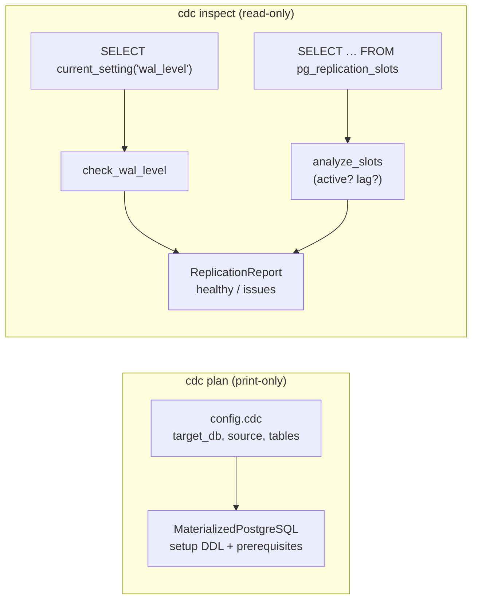

# Architecture

How pg-mcp-agent is put together, end to end. It is a **control-plane agent**: a
local LLM authors and validates SQL, a safety guard gates every call, a semantic
layer keeps the numbers honest, and one or more MCP servers run the actual data
plane (Postgres, ClickHouse, a data catalog).

## System overview

The dashed **WAL** arrow is the CDC capture path: it runs *in the database layer*
(ClickHouse's `MaterializedPostgreSQL` engine consuming the Postgres WAL), not in
the agent. The agent only inspects and proposes it — see [CDC](#cdc-control-plane).

## The request loop

What happens on one user turn (`agent.rs::handle_user`):

Key invariant: **the guard classifies the SQL, not the tool name.** Postgres/
ClickHouse MCP servers funnel everything through one `execute_sql`/
`run_select_query` tool, so "allow the read tool only" cannot work.

## The write-guard state machine

Dialect is **per server**: in a mixed pg+ch setup the router tells the guard which
backend owns each call (`router.dialect_for_tool`), so a ClickHouse `ALTER TABLE …
DELETE` is gated as a *write* (a row mutation), not blocked as Postgres DDL.

## Semantic layer & verification

Specs (`specs/*.spec.md`) are both **grounding** and **tests**:

Each spec carries a `Backend:` tag; `verify` routes it to a SQL tool on the
matching server (`router.sql_tool_for_dialect`) and `materialize` emits the DDL
shape for that engine.

## CDC control plane

`cdc.rs` proposes and validates the Postgres → ClickHouse capture path — it never
runs it. Two commands:

The capture itself (ClickHouse consuming the WAL) runs in the database layer;
the agent authors the DDL and watches slot health. Analytical rollups on the
replicated tables are then generated with `materialize` (specs tagged
`Backend: clickhouse`).

## Module responsibilities

| Module | Responsibility |
|--------|----------------|
| `main.rs` | CLI: `repl`, `verify`, `init-specs`, `materialize`, `cdc plan/inspect` |
| `agent.rs` | the loop: model ↔ tools ↔ guard ↔ execute; result caching |
| `guard.rs` | classify SQL (read/write/DDL/unknown) + policy; per-dialect rules |
| `router.rs` | connect N MCP servers, merge/namespace tools, route by dialect |
| `semantics.rs` | parse specs; grounding prompt; `verify` against the DB |
| `pipeline.rs` | `materialize`: verified spec → backend-aware MV DDL |
| `cdc.rs` | Postgres→ClickHouse replication plan + health inspection |
| `verify.rs` | answer verifier: re-derive figures, flag hallucinations |
| `analytics.rs` | in-memory result-set analytics (+ DataFusion `op=sql`) |
| `catalog.rs` | data-catalog MCP server + client (glossary/lineage grounding) |
| `audit.rs` | JSONL audit log of every tool call + guard decision |
| `mcp.rs` / `ollama.rs` | MCP stdio JSON-RPC client / Ollama `/api/chat` client |
| `knowledge.rs` | always-on analytical-Postgres cheatsheet in the prompt |

See [tutorial.md](tutorial.md) for hands-on, zero-setup examples of each command.
