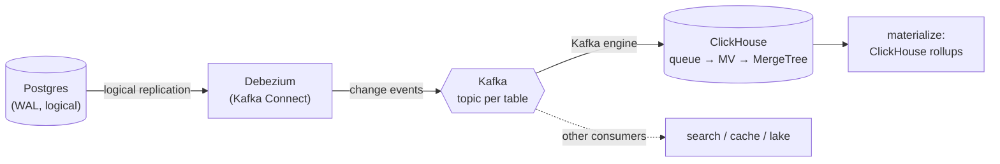

# CDC fan-out: Postgres → Debezium → Kafka → ClickHouse

The agent's `cdc` command has two capture paths from Postgres to ClickHouse:

- **Direct** (`cdc plan`) — ClickHouse's `MaterializedPostgreSQL` engine reads the
  Postgres WAL itself. Fewest moving parts; ClickHouse is the only consumer.
- **Fan-out** (`cdc plan --via kafka`) — **Debezium** captures the WAL and publishes
  change events to **Kafka**; ClickHouse (and anyone else) consumes from Kafka.

Reach for the fan-out when **more than one system needs the same change stream**
(ClickHouse for analytics *and* a search index *and* a cache, say), when you want
a **durable, replayable log** between capture and load, or when you already run
Kafka. The principle is *one well-operated capture path, many materialization
paths* — Kafka is that one path.



Like everything in `cdc.rs`, the agent is the **control plane**: it generates the
reviewable setup and watches health. It never runs the DDL or moves data — the
capture path runs in Debezium/Kafka/ClickHouse.

## Configure it

Add a `fanout` block inside the existing `cdc` section of your config (see
[`config.example.json`](../config.example.json) and the offline
[`config.pgch.mock.json`](../config.pgch.mock.json)):

```json
"cdc": {
  "target_database": "analytics",
  "source": {
    "host": "localhost", "port": 5432, "database": "shop",
    "user": "replicator", "password_env": "PGPASSWORD"
  },
  "tables": ["orders", "order_items"],
  "fanout": {
    "connector_name": "shop-connector",
    "topic_prefix": "pgch",
    "bootstrap_servers": "localhost:9092",
    "consumer_group": "clickhouse_analytics"
  }
}
```

- `topic_prefix` becomes the Debezium topic namespace: each table lands on
  `<topic_prefix>.<schema>.<table>` (e.g. `pgch.public.orders`).
- The password is read from `source.password_env` **at generate time** and never
  stored — if the env var is unset, a `{PASSWORD}` placeholder is emitted.
- `schema` defaults to `public`.

## 1. Generate the plan

```bash
cargo run -- cdc plan --via kafka config.pgch.mock.json
```

This prints three reviewable parts — nothing is applied:

1. **Postgres prerequisites** — `wal_level = logical`, a replication user, a
   primary key / `REPLICA IDENTITY`, and the `CREATE PUBLICATION`.
2. **The Debezium connector** — the exact JSON to `POST` to Kafka Connect's
   `/connectors` endpoint (a `curl` is shown), wired to your source, publication,
   and `table.include.list`.
3. **The ClickHouse ingest DDL** — per table, a Kafka-engine *queue* table on the
   topic, a MergeTree *target*, and a materialized view that unpacks the Debezium
   envelope into the target.

The MergeTree columns are a deliberate `TODO`: change events are JSON envelopes
(`before`/`after`/`op`), and only you know the table's real columns. The generated
MV extracts the `after` payload and `op`; replace the `payload String` column and
the `JSONExtractString` list with your actual schema (see the worked example).

## 2. Inspect health

Once the pipeline is running, `cdc inspect` checks **both** ends when `fanout` is
configured:

```bash
cargo run -- cdc inspect config.pgch.mock.json
```

```
Replication health
  ✓ wal_level = logical
  ✓ slot clickhouse_analytics — active, lag 0.0 MB

  Healthy: CDC is running and caught up.

Kafka consumer health
  ✓ ch-1 — active
  ✓ ch-2 — active

  Healthy: all consumers active and caught up.
```

The Postgres side queries `pg_replication_slots` (Debezium's slot). The Kafka side
queries ClickHouse's `system.kafka_consumers` and flags an **inactive** consumer
(ingestion stalled) or a consumer reporting an **exception** (e.g. a broker it
can't reach). If a source also reports message **lag**, that is flagged past a
threshold too. `inspect` exits non-zero when anything is unhealthy, so it drops
straight into a monitoring cron or the [CDC-health CI agent](cicd-agents.md).

> The offline demo works because the bundled mock servers answer these queries:
> mock Postgres returns a healthy slot, mock ClickHouse returns two healthy
> `system.kafka_consumers` rows. Against real databases, point the config at real
> `mcp_servers`.

## A worked example: near-real-time revenue, fanned out

You run an online shop on Postgres (`orders`, `order_items`) and want a live
revenue dashboard in ClickHouse — *and* you want the same order stream to feed a
fraud check later, so you choose Kafka rather than the direct path.

**Step 1 — plan.** With the config above, `cdc plan --via kafka` gives you the
Debezium connector JSON and this ClickHouse skeleton for `orders`:

```sql
CREATE TABLE analytics.orders_queue ( raw String )
ENGINE = Kafka
SETTINGS kafka_broker_list = 'localhost:9092',
         kafka_topic_list  = 'pgch.public.orders',
         kafka_group_name  = 'clickhouse_analytics',
         kafka_format      = 'JSONAsString';

CREATE TABLE analytics.orders ( payload String, _op LowCardinality(String), _ingested_at DateTime DEFAULT now() )
ENGINE = MergeTree ORDER BY tuple();

CREATE MATERIALIZED VIEW analytics.orders_mv TO analytics.orders AS
SELECT JSONExtractString(raw, 'after') AS payload,
       JSONExtractString(raw, 'op')    AS _op
FROM analytics.orders_queue;
```

**Step 2 — fill in the real columns.** Replace the placeholder target + MV with
the actual `orders` shape, extracting fields from the Debezium `after` object:

```sql
CREATE TABLE analytics.orders
(
    id          UInt64,
    customer_id UInt64,
    total_cents UInt64,
    created_at  DateTime64(3),
    _op         LowCardinality(String),
    _ingested_at DateTime DEFAULT now()
)
ENGINE = ReplacingMergeTree(_ingested_at)   -- last write wins per id
ORDER BY id;

CREATE MATERIALIZED VIEW analytics.orders_mv TO analytics.orders AS
SELECT JSONExtractUInt(raw, 'after', 'id')          AS id,
       JSONExtractUInt(raw, 'after', 'customer_id') AS customer_id,
       JSONExtractUInt(raw, 'after', 'total_cents') AS total_cents,
       parseDateTime64BestEffort(JSONExtractString(raw, 'after', 'created_at')) AS created_at,
       JSONExtractString(raw, 'op') AS _op
FROM analytics.orders_queue;
```

`ReplacingMergeTree` collapses the update/insert stream to the latest row per
`id`, which is what you want for a mutable OLTP table replicated via CDC.

**Step 3 — roll it up with the semantic layer.** Now the fan-out has landed the
data, treat `analytics.orders` like any ClickHouse table and define a *verified*
rollup spec (`Backend: clickhouse`) so the metric is grounded and tested:

```markdown
## Metric: hourly revenue (ClickHouse)
Question: revenue per hour for the live dashboard
Backend: clickhouse
Engine: SummingMergeTree()
Order by: hour
Expect: contains revenue
```sql
SELECT toStartOfHour(created_at) AS hour,
       sum(total_cents) / 100.0  AS revenue,
       count()                   AS orders
FROM analytics.orders FINAL
GROUP BY hour
ORDER BY hour;
```​
```

Then `cargo run -- materialize <config>` emits the incremental ClickHouse
materialized view for that rollup, and `cargo run -- verify <config>` checks it.
The whole chain is now **captured once (Debezium→Kafka), materialized many ways
(ClickHouse rollup today, fraud check tomorrow), and every metric is verified.**

**Step 4 — watch it.** Schedule `cdc inspect`; if the Debezium slot goes inactive
or a ClickHouse Kafka consumer throws, you get a non-zero exit and a clear reason
before the dashboard silently goes stale.

## Standing up the infrastructure (real, not mock)

The agent authors the plan; you run the runtime. A minimal local stack:

- **Kafka + Kafka Connect** with the Debezium Postgres connector plugin
  (`debezium/connect` image). `POST` the generated connector JSON to
  `http://connect:8083/connectors`.
- **Postgres** with `wal_level=logical` and the publication from the plan.
- **ClickHouse** with the Kafka-engine tables from the plan
  (`kafka_broker_list` pointing at your brokers).

Point a two-server config at real MCP servers (`uvx postgres-mcp` +
`uvx mcp-clickhouse`, each with a `dialect`), keep the same `cdc.fanout` block,
and the exact commands above work against live infrastructure.

## Direct vs fan-out — which to use

| | Direct (`cdc plan`) | Fan-out (`cdc plan --via kafka`) |
|---|---|---|
| Moving parts | ClickHouse only | Debezium + Kafka + ClickHouse |
| Consumers | ClickHouse | many (Kafka topic) |
| Replay / buffering | no | yes (Kafka retention) |
| Best when | one analytics sink | several sinks, or you already run Kafka |
| Health check | `pg_replication_slots` | + `system.kafka_consumers` |

See [architecture.md](architecture.md) for where CDC sits in the whole system,
and [clickhouse-integration.md](clickhouse-integration.md) for the ClickHouse
design notes.
