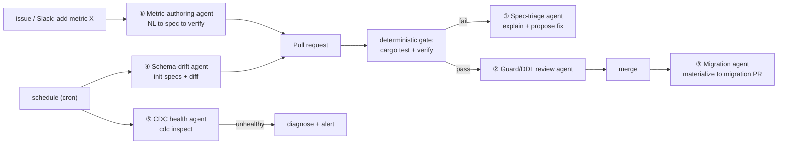

# AI agents for CI/CD

pg-mcp-agent already ships the hard part for automation: **deterministic commands
that exit non-zero on failure** (`verify`, `cdc inspect`) and **safe print-only
generators** (`materialize`, `cdc plan`, `init-specs`). Those are the gates. AI
agents add *judgment* on top of the gates — triaging failures, proposing fixes,
authoring specs, and reviewing risk — without ever being the thing that applies a
change to a database.

Guiding principle (from [product-strategy.md](product-strategy.md) and the Alation
caution in [roadmap-ecosystem-pipelines.md](roadmap-ecosystem-pipelines.md)): **let
determinism do the gating; let agents do the drafting and triage.** Every agent
below proposes; a human or a deterministic check disposes.

## The pipeline at a glance



## Proposed agents

| # | Agent | Trigger | Built on | Deterministic backstop |
|---|-------|---------|----------|------------------------|
| ① | **Spec-triage** | `verify` fails in CI | spec + failure output | the `verify` exit code still gates |
| ② | **Guard / DDL review** | PR touches `guard.rs`, `config`, or a migration | diff + guard classifier | policy unit tests; human approval |
| ③ | **Migration author** | verified spec merged | `materialize` output | DDL applied only by human/CD, gated by guard |
| ④ | **Schema-drift watch** | schedule | `init-specs` + git diff | opens a PR; never edits main directly |
| ⑤ | **CDC health / on-call** | schedule | `cdc inspect` report | `inspect` exit code; read-only queries |
| ⑥ | **Metric authoring (NL→spec)** | issue / chat request | semantic layer + catalog | new spec must pass `verify` before merge |
| ⑦ | **Answer-verifier regression** | PR touches prompt/knowledge/semantics | mock servers + `verify.rs` | golden-answer assertions |
| ⑧ | **Audit summarizer** | schedule / release | `audit.rs` JSONL | none needed (reporting only) |

### ① Spec-triage agent
When `cargo run -- verify` fails in CI, this agent reads the failing spec, the
`Expect:` clause, and the error, then comments on the PR with a diagnosis (schema
changed? column renamed? metric definition wrong?) and a suggested spec/SQL edit.
It does **not** merge — the red `verify` gate stays authoritative. High value
because a failing metric is exactly where a human wastes time.

### ② Guard / DDL review agent
Runs on PRs that touch `guard.rs`, the guard config, or any generated migration.
It checks for policy *regressions* (did someone flip `allow_ddl` to true? weaken a
classification?) and reviews `materialize`/`cdc plan` DDL for footguns
(unbounded `POPULATE`, a ClickHouse `ORDER BY tuple()` left as the default, a
Postgres MV without a refresh plan). Pairs with the existing `/security-review`
and `/code-review` flows.

### ③ Migration author
On merge of a verified spec, run `materialize` and open a *migration* PR with the
generated MV DDL. The agent drafts; CD (or a human) applies. The guard already
gates DDL, so even an over-eager migration cannot self-apply.

### ④ Schema-drift watch
A scheduled routine runs `init-specs` against a catalog/DB, diffs the result
against the committed specs, and — when new tables/columns/relationships appear —
opens a PR proposing glossary and metric updates. Keeps the semantic layer from
rotting silently. This is the "catalog sub-agent" from the roadmap, scheduled.

### ⑤ CDC health / on-call
A scheduled `cdc inspect`; when it reports an inactive slot or lag, the agent
diagnoses (consumer down vs. slow vs. WAL bloat risk) and posts a remediation
suggestion to Slack/issues. Read-only, so it is safe to run often.

### ⑥ Metric authoring (NL → spec)
The most product-shaped agent: a teammate files "we need weekly active customers
by plan," and the agent drafts a `Backend`-tagged `*.spec.md` grounded in the
catalog glossary, runs `verify`, iterates on failures, and opens a PR only once it
passes. Turns metric requests into reviewed, tested definitions.

### ⑦ Answer-verifier regression
Replays a fixed suite of NL questions against the **mock servers** and asserts the
answer verifier ([`verify.rs`](../src/verify.rs)) still flags planted
hallucinations and passes correct figures. Catches prompt/grounding regressions
when `knowledge.rs`, `semantics.rs`, or the system prompt changes — no live DB or
paid model needed.

### ⑧ Audit summarizer
Periodically summarizes the [`audit.rs`](../src/audit.rs) JSONL: how many
writes/DDL were confirmed vs blocked, which statements recurred, anomalies. Feeds
a weekly report or a release note.

## How to run them here

Three substrates, in increasing autonomy:

1. **GitHub Actions (deterministic gates).** The commands already fit CI:

   ```yaml
   # .github/workflows/specs.yml
   name: metrics
   on: [pull_request]
   jobs:
     verify:
       runs-on: ubuntu-latest
       steps:
         - uses: actions/checkout@v4
         - uses: dtolnay/rust-toolchain@stable
         - run: cargo test
         - run: cargo run -- verify config.pgch.mock.json   # exits non-zero on a bad metric
   ```

   Against a real database, point the step at a config with live `mcp_servers`
   and DB secrets from the CI vault.

2. **Claude Code review/skills (PR-time judgment).** `/code-review` and
   `/security-review` already cover agents ② and ⑦ partially; a repo
   `.claude/agents/*.md` subagent can specialize the spec-triage (①) and
   guard-review (②) prompts.

3. **Scheduled cloud agents / routines (autonomous).** Agents ④, ⑤, ⑧ are cron
   routines that run a command, interpret the output, and open a PR or post an
   alert — never touching main or a database directly.

## What to build first

1. **Wire `verify` (and `cargo test`) as the GitHub Actions gate.** Zero AI,
   immediate value, and every agent above assumes this gate exists.
2. **Spec-triage agent (①).** Highest signal: it attaches to the gate that fails
   most often and saves the most human time.
3. **CDC health agent (⑤)** once real replication is running.
4. **Metric-authoring agent (⑥)** — the one that turns this from a tool into a
   product surface teammates ask things of.

Everything here keeps the safety model intact: **agents draft and triage; the
guard, the `verify` exit code, and a human approval do the gating.**
